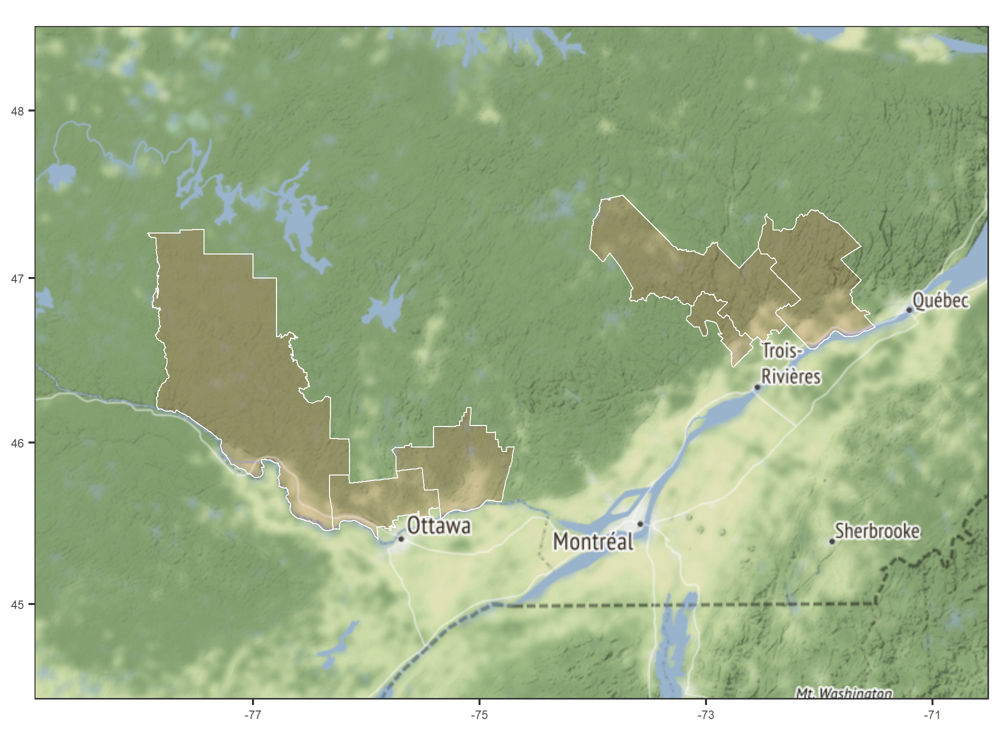
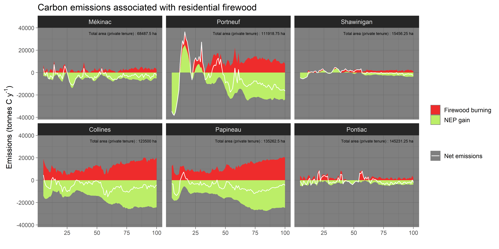
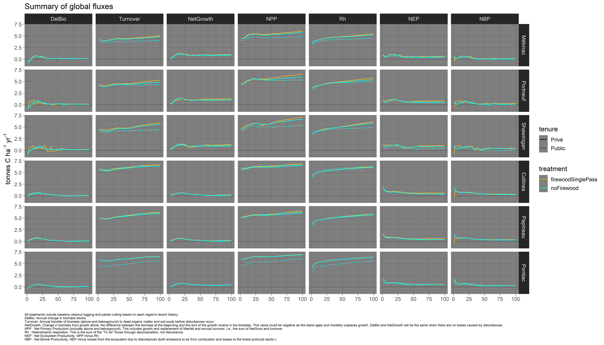
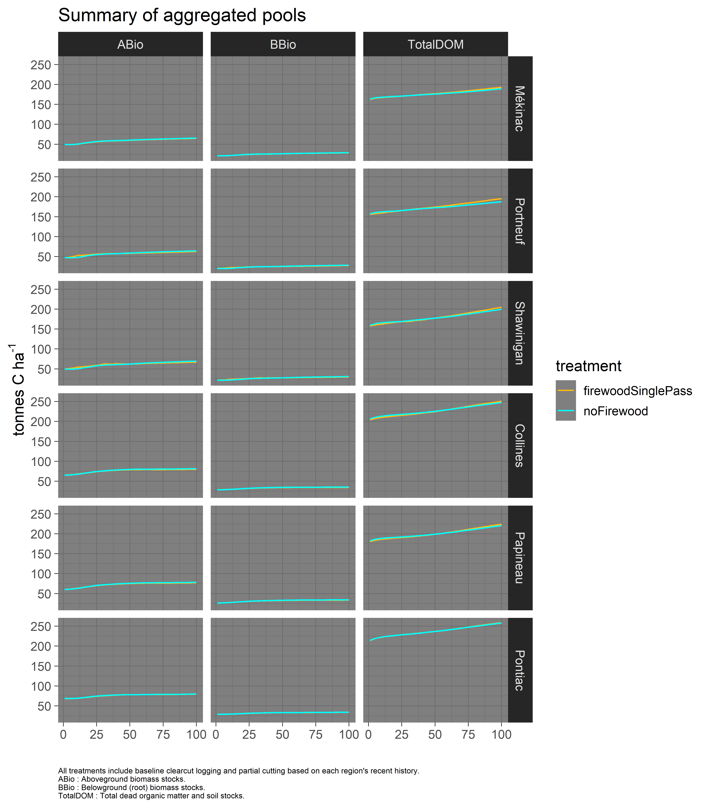
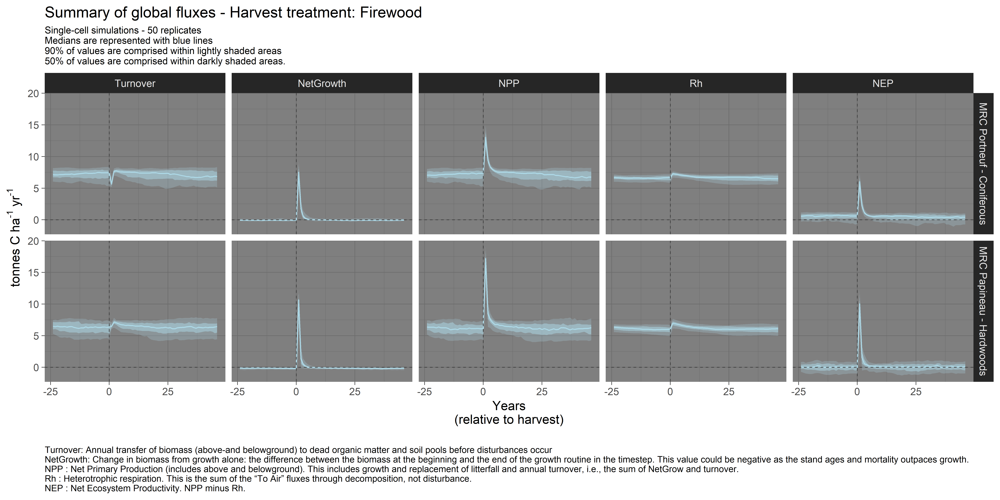
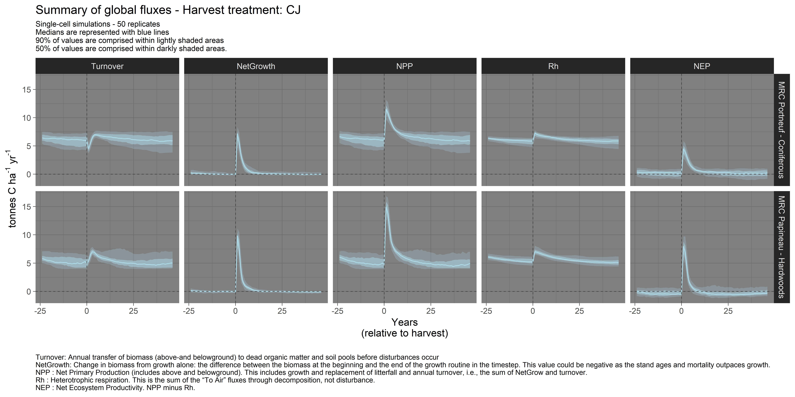
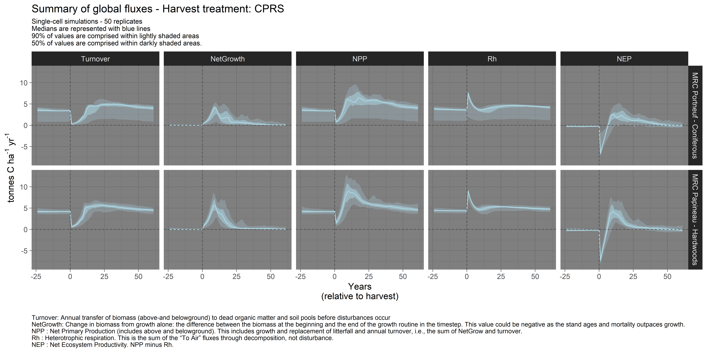

Updated on May 06 2019

-------

### General description

This repository contains input files, documentation and simulation outputs (coming soon).

-----------

### Table of content
- [Study areas][01]
- [Preliminary results (landscape level)][02]
- [Single-cell (stand-level) simulations][03]
- Area specific results (external links)
    + [MRC 'Centre' (Mékinac, Shawinigan, Portneuf)][04]
    + [MRC 'Outaouais' (Collines, Papineau, Pontiac)][05]

[01]: #study-areas
[02]: #preliminary-results-landscape-level
[03]: #single-cell-simulations
[04]: https://github.com/dcyr/firewood_landis/blob/master/MRCCentre.md
[05]: https://github.com/dcyr/firewood_landis/blob/master/MRCOuta.md

### Study areas

The study areas cover the Sugar Maple and Yellow birch (temperate hardwoods) to the Balsam Fir and White Birch biomclimatic domains (mixedwood boreal). More specifically each of the simulated areas includes three MRCs [_(Municipalités régionales de comté)_][11]. The westernmost one is located in Outaouais and is the warmer study area, while the other one is located in Mauricie and Centre-du-Québec and extents further north, hence including more boreal species and forest types.

[11]: https://en.wikipedia.org/wiki/Regional_county_municipality

-----------  

-----------

### Preliminary results (landscape level)
Disclaimer: These results are preliminary and __will__ change. They are presented here to verify the current implementation of the experiment and the overall dynamics of the simulated systems. Modification of the input parameters are planned and may substantially affect results.

Note that net emissions associated with production and consumption of firewood are currently estimated indirectly, which causes some of the interannual variations. Upcoming simulations, which will include replications of each treatment, will smooth out some of those variations.
  
  

  
   

  

-----------

### Single-cell simulations

Here you can find illustrations of single-cell simulations in both areas. These figures illustrate how carbon stocks and fluxes evolve as forest stands develop with and without the influence of various harvest treatments.

#### Carbon stocks 

#### Carbon fluxes

##### Firewood harvesting (16% every 35 years)
   

##### Partial cutting (33% every 35 years)

##### Clearcut (95% every 100 years)

  

